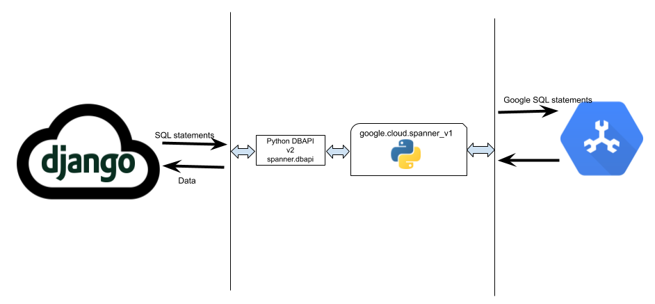

# django-spanner
ORM plugin for using Cloud Spanner as a database for Django.

# 🚨THIS CODE IS STILL UNDER DEVELOPMENT🚨

## Table of contents
- [Installing it](#installing-it)
- [Using it](#using-it)
    - [Format](#format)
    - [Example](#example)
- [Functional tests](#functional-tests)
- [Django integration tests](#django-integration-tests)
    - [django_test_suite.sh](#django_test_suitesh)
        - [Environment variables](#environment-variables)
        - [Example run](#example-run)
    - [Parallelization script](#parallelization-script)
        - [Environment variables](#environment-variables)
        - [Example run](#example-run)
- [Limitations](#limitations)
- [How it works](#how-it-works)
    - [Overall design](#overall-design)
    - [Internals](#internals)


## Installing it

Use the version of django-spanner that corresponds to your version of Django.
For example, django-spanner 2.2.x works with Django 2.2.y. (This is the only
supported version at this time.)

The minor release number of Django doesn't correspond to the minor release
number of django-spanner. Use the latest minor release of each.

```shell
pip3 install --user .
```

## Using it
After [installing it](#installing-it), you'll need to edit your Django `settings.py` file:

* Add `django_spanner` as the very first entry in the `INSTALLED_APPS` setting
```python
INSTALLED_APPS = [
    'django_spanner',
    ...
]
```

* Edit the `DATABASES` setting to point to an EXISTING database

### Format

```python
DATABASES = {
    'default': {
        'ENGINE': 'django_spanner',
        'PROJECT': '<project_id>',
        'INSTANCE': '<instance_id>',
        'NAME': '<database_name>',
        # Only include this if you need to specify where to retrieve the
        # service account JSON for the credentials to connect to Cloud Spanner.
        'OPTIONS': {
            'credentials_uri': '<credentials_uri>',
        },
    },
}
```

### Example
For example:

```python
DATABASES = {
    'default': {
        'ENGINE': 'django_spanner',
        'PROJECT': 'appdev-soda-spanner-staging', # Or the GCP project-id
        'INSTANCE': 'django-dev1', # Or the Cloud Spanner instance
        'NAME': 'db1', # Or the Cloud Spanner database to use
    }
}
```

## Limitations

### Transaction management isn't supported

django-spanner always works in Django's default transaction behavior,
autocommit mode. There's no way to turn this off and control transactions
manually such as with `django.db.transaction.atomic()`.

### `AutoField` generates random IDs

Spanner doesn't have a way to auto-generate primary key values. Instead,
django-spanner monkeypatches `AutoField` to generate a random UUID4. It
generates a default using `Field`'s `default` option which means `AutoField`s
will have a value when a model instance is created. For example:

```
>>> ExampleModel()
>>> ExampleModel.pk
4229421414948291880
```

To avoid [hotspotting](https://cloud.google.com/spanner/docs/schema-design#uuid_primary_key),
these IDs are not monotonically increasing. This means that sorting models by
id isn't guaranteed to return them in the order in which they were created.

### `ForeignKey` constraints aren't created

django-spanner [doesn't create foreign key constraints](https://github.com/googleapis/python-spanner-django/issues/313).

### Check constraints aren't supported

Spanner doesn't support CHECK constraints so one isn't created for
[`PositiveIntegerField`](https://docs.djangoproject.com/en/stable/ref/models/fields/#positiveintegerfield)
and [`CheckConstraint`](https://docs.djangoproject.com/en/stable/ref/models/constraints/#checkconstraint)
can't be used.

### `DecimalField` isn't supported

Spanner doesn't support a NUMERIC data type that allows storing high precision
decimal values without the possibility of data loss.

### `Variance` and `StdDev` database functions aren't supported

Spanner doesn't have these functions.

### `Meta.order_with_respect_to` model option isn't supported

This feature uses a column name that starts with an underscore (`_order`) which
Spanner doesn't allow.

### Random `QuerySet` ordering isn't supported

Spanner doesn't support it. For example:

```
>>> ExampleModel.objects.order_by('?')
...
django.db.utils.ProgrammingError: 400 Function not found: RANDOM ... FROM
example_model ORDER BY RANDOM() ASC
```

### Schema migrations

Spanner has some limitations on schema changes which you must respect:

* Renaming tables and columns isn't supported.
* A column's type can't be changed.
* A table's primary key can't be altered.
* Migrations aren't atomic since django-spanner doesn't support transactions.

### Computations that yield FLOAT64 values can't be assigned to INT64 columns

Spanner [doesn't support this](https://github.com/googleapis/python-spanner-django/issues/331).

For example, if `integer` is `IntegerField`:

```
>>> ExampleModel.objects.update(integer=F('integer') / 2)
...
django.db.utils.ProgrammingError: 400 Value of type FLOAT64 cannot be
assigned to integer, which has type INT64 [at 1:46]\nUPDATE
example_model SET integer = (example_model.integer /...
```

### Addition with null values crash

For example:

```
>>> Book.objects.annotate(adjusted_rating=F('rating') + None)
...
google.api_core.exceptions.InvalidArgument: 400 Operands of + cannot be literal
NULL ...
```

## How it works

### Overall design


### Internals


# 🚨THIS CODE IS STILL UNDER DEVELOPMENT🚨
